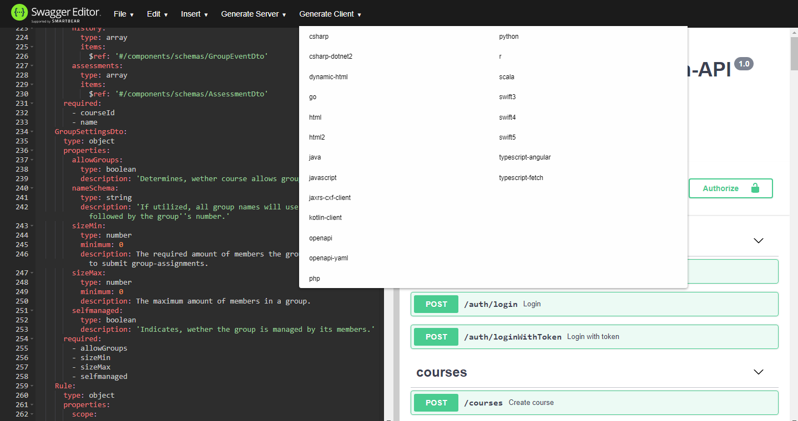
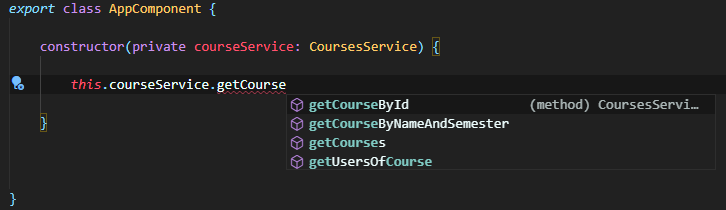

# Getting started

Interacting with the Student-Management-System's API can be simplified by utilizing a generated client for your desired programming language
(i.e. Java, Python, C#, JavaScript, TypeScript). If you prefer to not work with a generated client, you can also use a native http-library.
In this case, you're responsible for correctly assembling the requested URLs and data objects. Using a generated client is generally recommended,
because it guarantees correctly ordered and typed parameters and displays which parameters are optional. It also takes care of (de)serializing
the request objects to/from JSON.

The automatically generated [OpenAPI-Specification](https://en.wikipedia.org/wiki/OpenAPI_Specification) of the system can be found here:

- [API-Specification](http://147.172.178.30:3000/api-json)

This specification can be inserted into tools like [Swagger-Editor](https://editor.swagger.io/), which support the generation of such clients.
In the future, we might also support the download of prepackaged .jar's and npm packages.



## Importing the client into your project

Once you have acquired an API-Client, you must integrate it into your project.

TODO: Add explanation

## Setting up the base path

The client must know the url of our server in order to issue requests.
There are multiple ways to configure the base path.

=== "Angular"
	```typescript
	ApiModule.forRoot(() => new Configuration({
		basePath: "http://example.com/api"
	}))

	// or (BASE_PATH is imported from the API-client library)
	
	providers: [
		{ provide: BASE_PATH, useValue: "http://example.com/api" },
	]
	```

=== "Java"
	```java
	// TODO
	```

## Ready to go

If you have successfully added the client to your project, you should be able to use the API just like any other local library.
Classes are named according to their tag in the API-Specification and suffixed with "Service". Every service will contain methods corresponding to its routes.

Example:
Tag "Courses" with Route "/courses" will be available as CoursesService.getCourses.



You can create requests as displayed here:

=== "TypeScript"
	```typescript
		// Get all Java-courses
		this.courseService.getCourses("java").subscribe(
			result => console.log(result);
			error => console.log(error)
		);
	```

=== "Java"
	```java
	// TODO
	```
