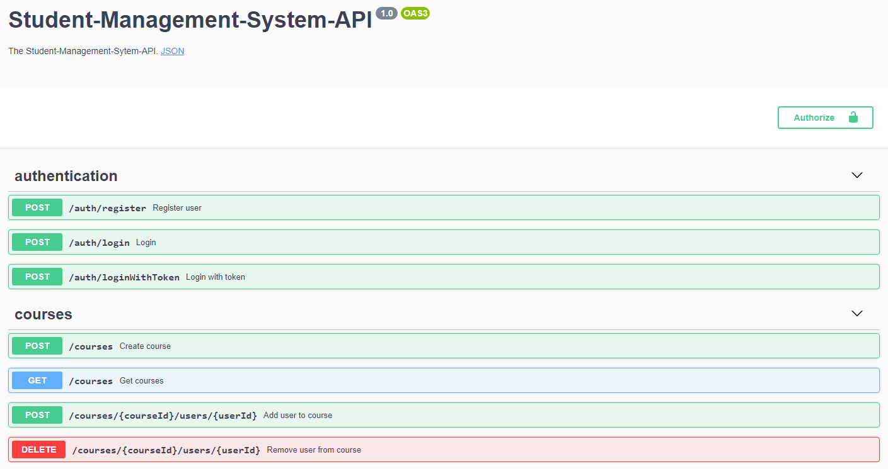

# Introduction

This website hosts documentation about the **Student-Management-System's API**.
The [Swagger-UI](http://147.172.178.30:3000/api/) provides information about the available endpoints and data schemas,
and will be referenced in the documentation. However, the it does not explain how the API can be used by other systems.
Therefore, we will use this place to offer additional guidance for developers, that are building applications, which interact with the 
Student-Management-System's API.

Since the Student-Management-System also provides a [frontend client](http://147.172.178.30/WEB-APP/courses), a lot of the described features will already be implemented there.
Before you start your work on an additional application, check if the client already fulfills your use case or should be extended to accommodate
it. Feel free to [contribute](https://github.com/Student-Management-System/StudentMgmt-Client)!

If you're looking for samples of systems integrating the API, take a look into these [repositories](https://github.com/Student-Management-System).
Also make sure to check out our [FAQ](/faq).

## Features

The Student-Management-System's API provides the ability to...

- Create and manage courses
- Create and schedule assignments
- Create groups to collaborate on homework
- Grade assignments
- Coordinate grading process among teaching staff
- Track students learning progress and admission status
- Subscribe to events in a course (i.e. to receive notification when assignment submission closes)

## Questions, Bug reports and Feature requests

If you have any questions about the system, discovered a bug or require a new feature, feel free create an Issue
in the [GitHub repository](https://github.com/Student-Management-System/StudentMgmt-Backend/issues) or contact us directly [here](TODO).

## Helpful links

#### [FAQ](/faq)
#### [GitHub](https://github.com/Student-Management-System/StudentMgmt-Backend)
#### [Swagger-UI](http://147.172.178.30:3000/api/)
#### [API-Specification](http://147.172.178.30:3000/api-json)
#### [Bug reports](https://github.com/Student-Management-System/StudentMgmt-Backend/issues)
